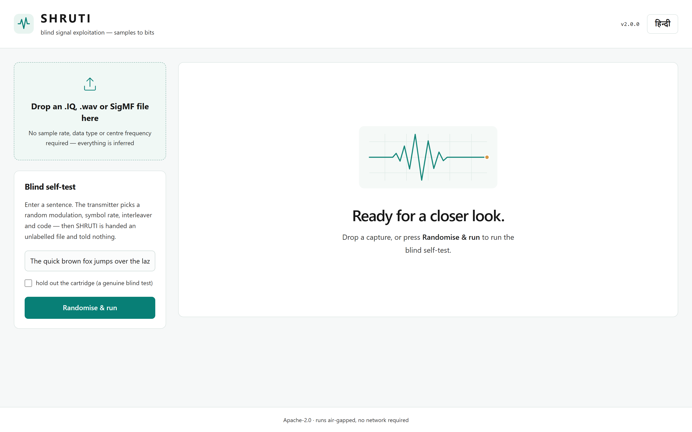
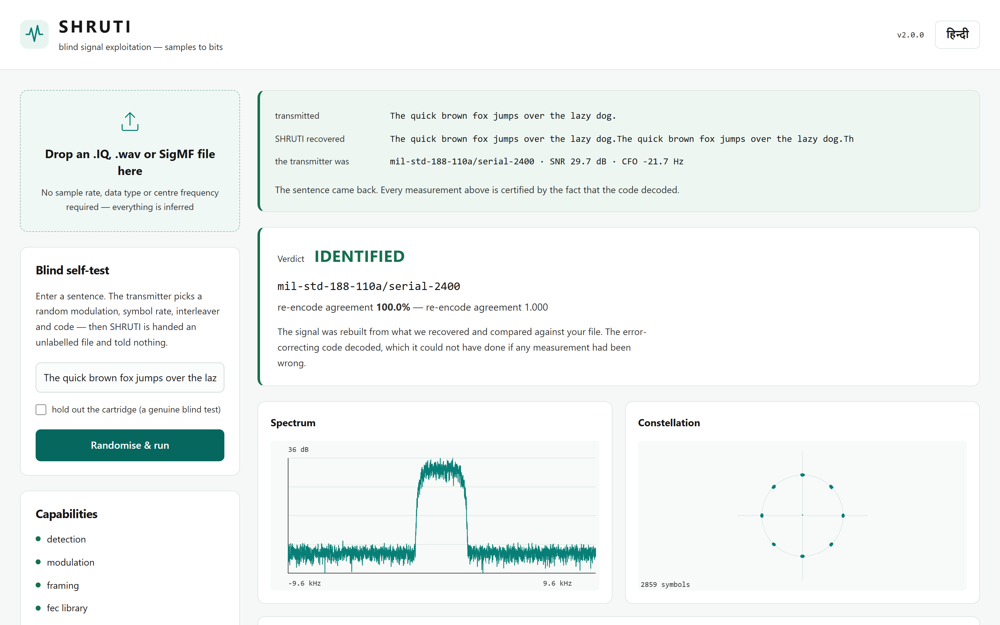
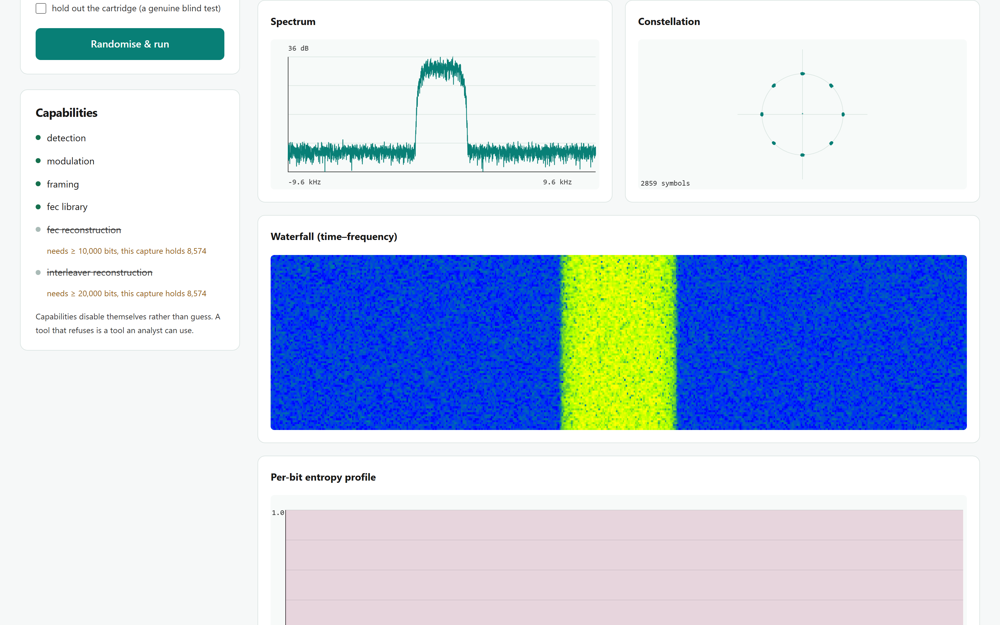
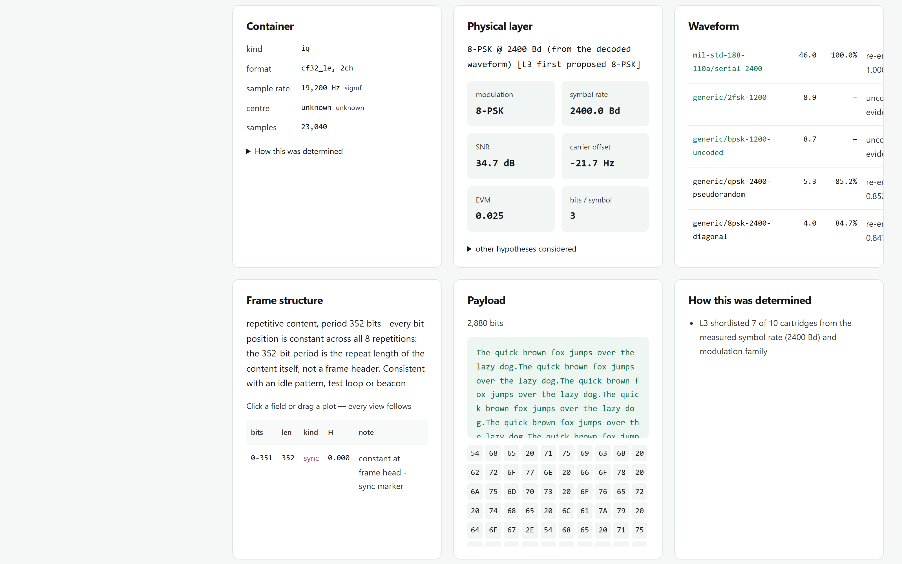
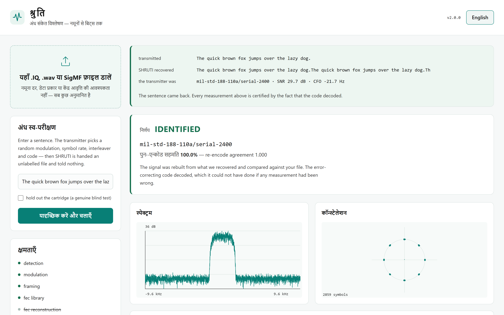
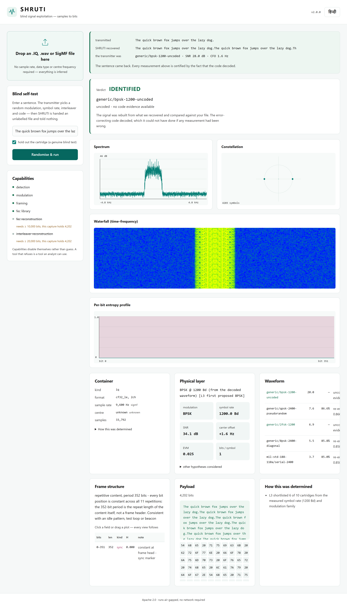

# SHRUTI — blind signal exploitation, samples to bits

> `śruti` (श्रुति) — that which is heard. `artha` (अर्थ) — its meaning.

Give SHRUTI an unlabelled `.IQ` or `.wav` recording and it works out how to
**rebuild** the signal, rebuilds it, and compares the reconstruction against your
original samples. Then it finishes the job: undoes the interleaving, corrects the
errors, and reads the message.

```
$ shruti selftest --message "The quick brown fox jumps over the lazy dog."

  Randomising the transmitter...
  Transmitter configured and WITHHELD.
  The analyser is started now. It receives that file and nothing else.
------------------------------------------------------------------------
VERDICT: IDENTIFIED
  physical:  8-PSK @ 2400.0 Bd (EVM 0.035, SNR 29.8 dB)
  waveform:  generic/8psk-2400-diagonal (re-encode agreement 1.000)
  gated:     fec_reconstruction: DISABLED — needs ≥ 10000 bits, this capture holds 8004

  RECOVERED PAYLOAD:
    "The quick brown fox jumps over the lazy dog."
------------------------------------------------------------------------
  RESULT: PASS - the sentence came back.
```

**The error-correcting code is not the last obstacle before the payload — it is
the most precise measuring instrument in the recording.** If any upstream
estimate is even slightly wrong the code does not decode. So when the message
appears, the measurements are not *confident* — they are **demonstrated**.

---

## Quick start

```bash
pip install -e ".[gui]"
shruti selftest                 # end-to-end blind self-test
shruti gui                      # browser interface at http://127.0.0.1:8000
```

```bash
shruti analyse capture.wav --report out/          # analyse a real file
shruti synth out.sigmf --cartridge ccsds/tm-concatenated --snr 8
shruti cartridge list                             # the waveform library
```

**Nothing is asked of you.** No sample rate, no data type, no centre frequency —
L0 infers all of it, tells you what it inferred and why, and lets you override.

---

## The interface

`shruti gui` serves a browser interface at `http://127.0.0.1:8000`. Every asset is
served from the process itself — no CDN, because on an air-gapped machine there
is no CDN.

### Landing — drop a file, or run the self-test



Two ways in: drop a capture, or press **Randomise & run** to have the tool
generate a signal, forget the configuration, and analyse it blind.

### A completed self-test



The sentence that went in came back out, the withheld transmitter configuration
is revealed for comparison, and the verdict reports re-encode agreement rather
than a confidence score.

### Spectrum, constellation, waterfall, entropy



### Every measurement, with its provenance



Container inference is shown rather than hidden — *how this was determined* is a
disclosure on every panel, not a footnote. The waveform ranking lists what was
rejected alongside what matched.

### Bilingual



### Hold-out mode — a genuinely blind run



With the waveform's own cartridge removed from the library, the library-match
track cannot fire and the blind reconstruction tracks have to do the work
unaided.

> The full set, including the whole-page capture, is in [`docs/ui/`](docs/ui).
> Regenerate them against a running server with
> `python scripts/capture_ui.py` (needs `playwright`).

---

## Capabilities

| Capability | Where | Status |
|---|---|---|
| Sampling frequency, modulation, FEC, interleaving | `l0_container`, `l3_proposals`, `l6_fec` | ✅ |
| Demodulate **FSK, QAM, PSK** | `l5_demod` — 2/4-FSK, 16/32/64-QAM, BPSK/QPSK/8-PSK/OQPSK/π4-DQPSK | ✅ |
| De-interleave **block, convolution, diagonal, pseudo random** | `l6_fec/interleave.py` — all four by name | ✅ |
| FEC — **short-constrained convolutional + Viterbi, RS, concatenated, LDPC** | `l6_fec/{conv,rs,ldpc}.py` | ✅ |
| Bit stream correlation → header and payload | `l7_bits` — entropy segmentation, field typing | ✅ |
| **GUI**: spectrum, **constellation**, **waterfall** | `shruti/web` + `frontend/` | ✅ |
| HF / VHF / UHF | Watterson channel (ITU-R F.1487), SSB audio path | ✅ |
| `.IQ` and `.wav` handled differently | Mono-SSB vs IQ-in-stereo decided by Hermitian test | ✅ |
| Spectral relationship across both container types | The twin renders **both from one parameter set** | ✅ |
| Sensor-to-sensor parameter variation | Per-sensor profiles, cross-file consistency | ✅ |

---

## How it works

```
L0  container + format inference     wav / raw IQ / SigMF, dtype sniffing, anchoring
L1  receiver self-model              reference-free artefact tests
L2  wideband detection               OS-CFAR, emitter tracking
L3  proposal short-list              classical estimators (the CNN is 11th of 12)
L4  the twin                         forward synthesis + inversion  ← the project
L4b iterative peeling                subtract the strongest, re-scan
L5  soft demodulation                LLRs, not hard bits; ambiguities enumerated
L6  interleaver + FEC                tracks A / B / C
L7  bitstream structure              framing, entropy, field typing
L8  GUI, SigMF, evidence
         ▲                                    │
         └────── closure feedback ────────────┘
```

**The feedback arrow is the idea. Everything else is competent engineering.**

Three things follow from having a *generative* model rather than a classifier:

1. **Verification by resynthesis.** Re-encode what was recovered, re-render, and
   difference against the original samples.
2. **The test oracle.** Every parameter SHRUTI recovers is an *input* to the
   synthesiser, so property-based tests generate unlimited labelled cases.
   *We cannot run out of test data, because the thing that analyses signals is
   the same thing that makes them.*
3. **Calibrated refusal.** A χ² goodness-of-fit p-value, not a dB threshold, and
   capabilities that grey themselves out when the capture is too short.

---

## Waveform cartridges — a waveform is *data*, not code

```yaml
# cartridges/milstd/188-110a-serial-2400.yaml
id: mil-std-188-110a/serial-2400
band: HF
chain:
  - fec:            {type: convolutional, K: 7, rate: "1/2", poly: ["0o133", "0o171"]}
  - interleaver:    {type: block, rows: 40, cols: 72}
  - scrambler_post: {type: additive, poly: "0o1001", seed: "0xBAD", width: 9}
  - mapper:         {type: psk, order: 8}
  - shaping:        {type: rrc, rolloff: 0.35}
  - modulator:      {symbol_rate_bd: 2400, centre_hz: 1800, ssb: usb}
```

One file, and every layer picks it up at once — the twin gets a forward model,
L6 gets something to match against, the report gets to say *"consistent with
MIL-STD-188-110A"* instead of *"8-PSK"*.

**Adding a waveform is writing a text file, not changing code.** That is what
makes *"we can support a new emitter next month"* true rather than rhetorical,
and it draws the open/classified boundary a government needs: the engine is
Apache-2.0, the cartridge library is data and can be held privately.

---

## Deployment

The deployment ladder is backed by the `Dockerfile` and `docs/DEPLOY.md`:

| Tier | Target | Cost |
|---|---|---|
| T0 | Static browser build → GitHub Pages | ₹0 |
| T1 | Live engine → Hugging Face Spaces (Docker, free CPU) | ₹0 |
| T2 | Google Cloud Run — same image, scale to zero | ₹0 |
| T3 | Colab notebook, CPU-only | ₹0 |
| **T4** | **Offline installer → air-gapped laptop. The real product** | **₹0** |
| T5 | Batch mode over an archive | ₹0 |

**SHRUTI never needs a network** — not for licensing, models, updates or
telemetry. The [`no-egress` CI job](.github/workflows/ci.yml) runs the whole
pipeline with `socket()` disabled and fails the build if anything tries to open
a connection. The property is enforced by the build, not asserted in prose.

---

## Licence position

**Every runtime dependency is BSD-3, MIT or Apache-2.0. Zero LGPL. Zero GPL.**

That is deliberate and enforced by CI. It is what lets the capability be forked
privately, extended with material that is never published, and deployed without
a procurement conversation about copyleft obligations.

- SigMF is implemented against the spec rather than importing LGPL `sigmf-python`
- Audio I/O uses stdlib `wave`, not libsndfile
- GF(2), GF(256), Viterbi, RS and LDPC are ours — `galois`/`commpy` are **test-only** cross-checks
- **GNU Radio is an oracle, never a dependency** — invoked out-of-process over files

Engine: Apache-2.0. Cartridges and corpus: CC-BY-4.0, licensed separately.

---

## Testing

```bash
pytest tests/test_units.py      # 58 unit tests, ~7 s
pytest tests/test_roundtrip.py  # the oracle: synth → analyse → assert
```

The round-trip suite asserts that for **every** cartridge the exact payload comes
back *and* a decode certificate is issued — across payload lengths, carrier
offsets and timing offsets.

---

## Honest limits

Stated up front rather than left to be discovered:

- **An unknown pseudo-random interleaver permutation is not blindly recoverable.**
  SHRUTI detects it and bounds its period and depth. It does not guess.
- **Absolute sampling frequency is not identifiable from a headerless file.**
  Every measurable quantity is a ratio. SHRUTI says so, then resolves it from
  sidecars, filename conventions or in-band anchors, and reports which.
- **RS uses the conventional basis**, not CCSDS's dual-basis symbol
  representation. Flagged in each cartridge as `basis: conventional`.
- **L6 tracks B and C** (algebraic and soft-syndrome reconstruction of *unknown*
  codes) work on a constrained hypothesis grid, not arbitrary codes.
- The LDPC family is SHRUTI-defined and reproducible from `(n, wc, wr, seed)`;
  published matrices load via the documented `from_alist` hook.
- Puncturing patterns are implemented but not yet verified bit-for-bit against
  the CCSDS Blue Book.

---

## Documents

- [`docs/ARCHITECTURE.md`](docs/ARCHITECTURE.md) — layer-by-layer detail
- [`docs/DEPLOY.md`](docs/DEPLOY.md) — every deployment tier, step by step

---

