<div align="center">

# SHRUTI

**Blind signal exploitation — from raw samples to decoded bits**

`śruti` (श्रुति) — *that which is heard*

**[▶ Live demo — shruti-55e53.web.app](https://shruti-55e53.web.app)**

</div>

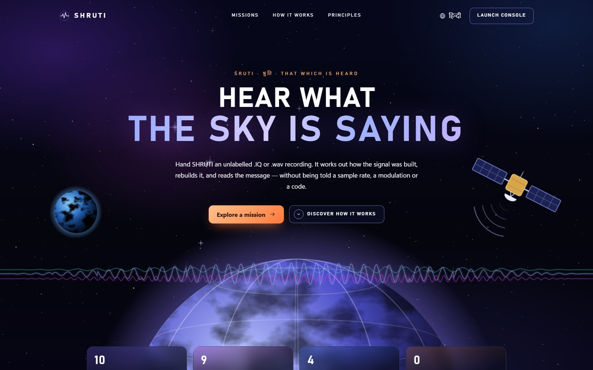

Hand SHRUTI an unlabelled `.IQ` or `.wav` recording. It works out how the signal
was built — sampling frequency, modulation, symbol rate, interleaver,
error-correcting code, frame structure — and reads the message. It only calls an
answer proven when the signal's own error-correcting code checks out; otherwise
it says so. Nothing is asked of the analyst: no sample rate, no data type, no
centre frequency.

**The error-correcting code is not the last obstacle before the payload — it is
the most precise measuring instrument in the recording.** If any upstream
estimate is even slightly wrong, the code does not decode. So when the message
appears, the measurements are not *confident* — they are **demonstrated**.

---

## Try it

**In the browser.** Open the [live demo](https://shruti-55e53.web.app), press
**Explore a mission**, then **Decode this signal**. Each mission is a capture the
engine was handed blind, with its transmitter configuration withheld. The
console walks through every stage of the analysis, then puts what was sent
beside what came back.

**Locally.** The interface is self-contained — every asset is bundled and
nothing is fetched at runtime:

```bash
cd frontend
npm install
npm run dev
```

---

## The interface

### Mission library

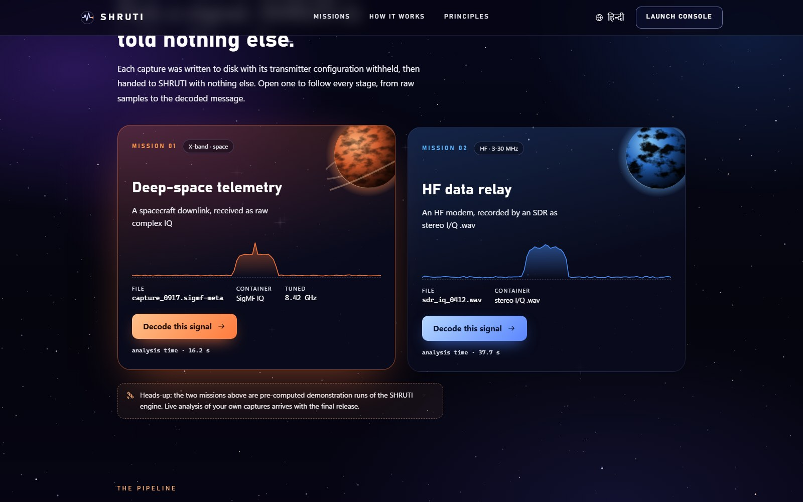

Two captures, chosen to exercise both container paths:

| | Mission 01 — Deep-space telemetry | Mission 02 — HF data relay |
|---|---|---|
| **Recording** | SigMF, complex IQ, 16 MS/s, tuned to 8.42 GHz | Stereo I/Q `.wav`, 19.2 kS/s |
| **Waveform (withheld)** | CCSDS TM: RS(255,223), block interleaver, pseudo-randomiser, K=7 rate-½ convolutional, QPSK | MIL-STD-188-110A serial tone: K=7 rate-½ convolutional, 40×72 block interleaver, scrambler, 8-PSK |
| **SHRUTI recovered** | QPSK at 2 MBd, carrier +3150.1 Hz, message intact | 8-PSK at 2400 Bd, carrier +37.0 Hz, message intact |

### The decode sequence

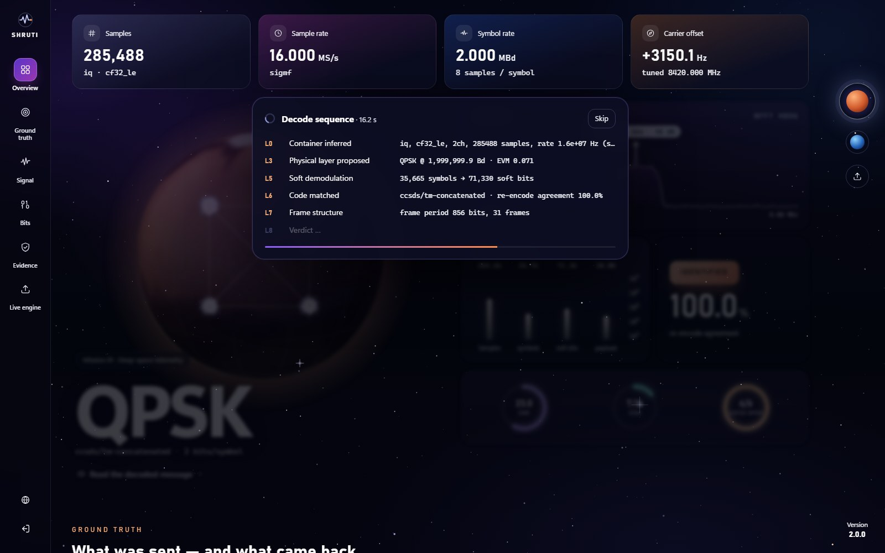

Each mission opens by stepping through the stages in the order the engine
reached them: container, physical layer, soft demodulation, code match, frame
structure, verdict.

### The console

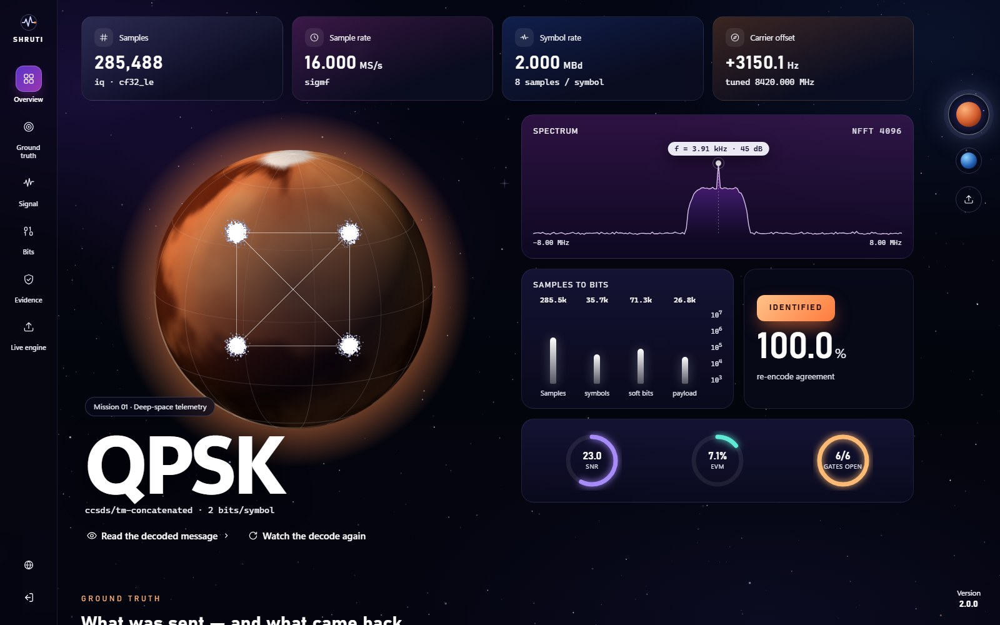

The constellation is drawn on the body the signal came from, with the ideal
lattice recovered by the M-th power estimator and laid over the received cloud.
The planet turns, and can be dragged to spin. Beside it: the spectrum, how many
samples became how many bits, the verdict and the re-encode agreement.

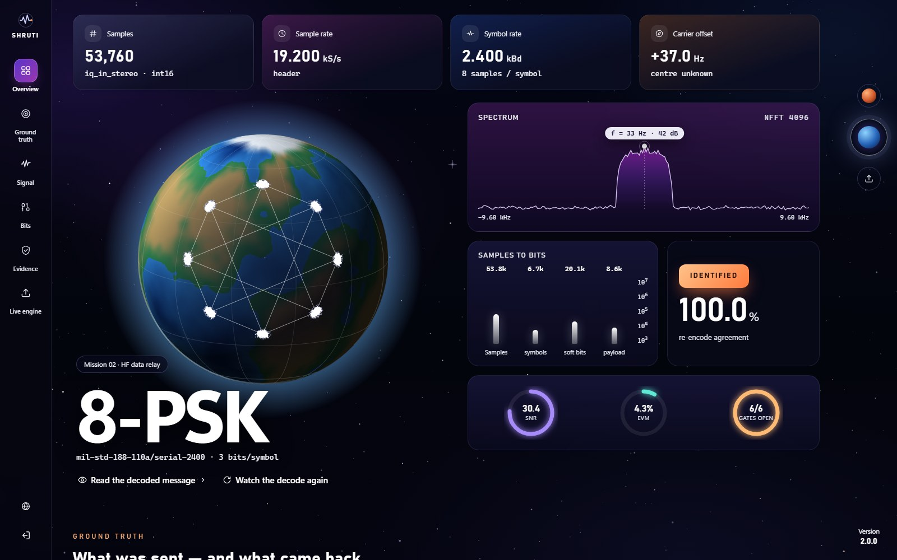

### Ground truth — what was sent, and what came back

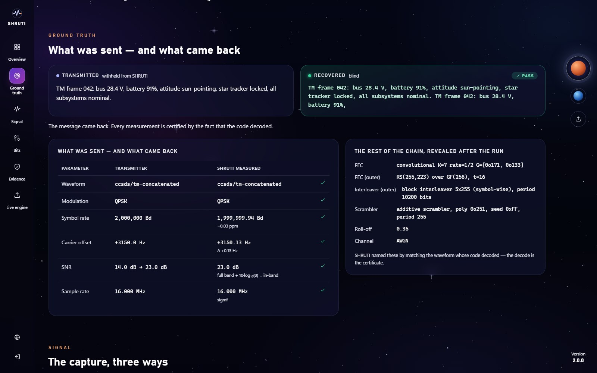

Every measurement is set against the configuration SHRUTI was never shown. On
Mission 01 the symbol rate lands within 0.03 ppm and the carrier offset within
0.13 Hz. SNR is compared on the same footing: the transmitter's full-band figure
is converted to in-band (+10·log₁₀ of the samples per symbol) before it is set
beside the matched-filter estimate.

### Signal, bits and provenance

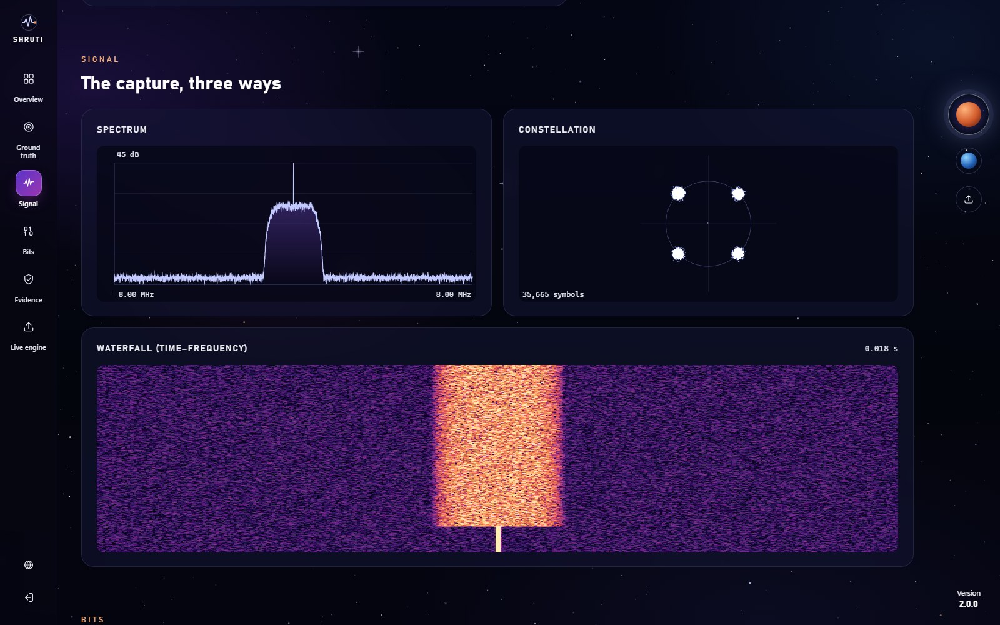

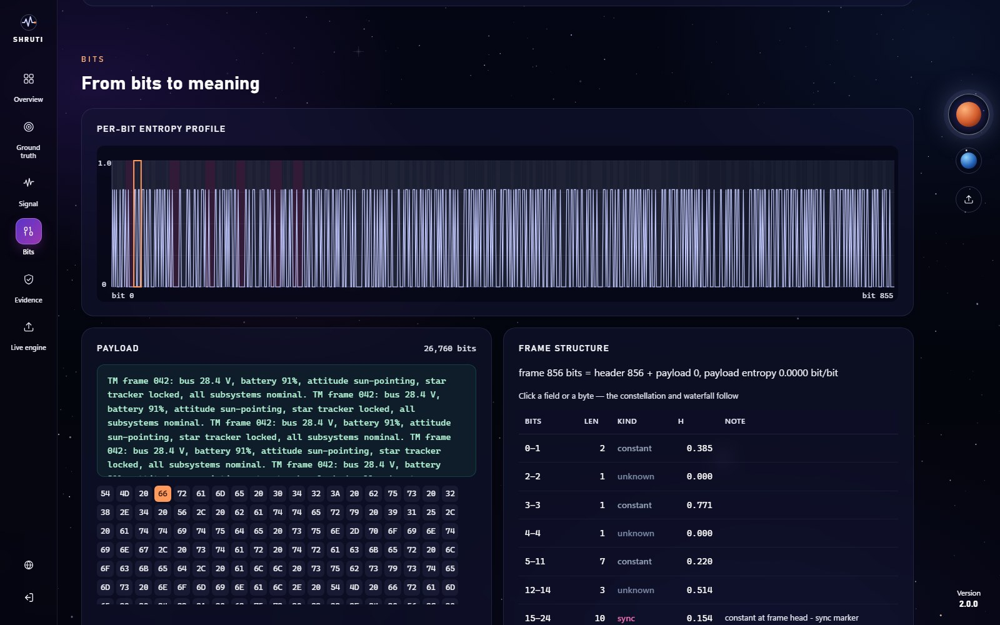

Click any byte of the payload, or any field of the frame, and the symbols that
carried it light up in the constellation and the samples that carried those
light up in the waterfall. The mapping between layers is arithmetic rather than
a lookup table, because the chain is modelled end to end.

### The pipeline, in Hindi, and on a phone

| | |
|---|---|
| 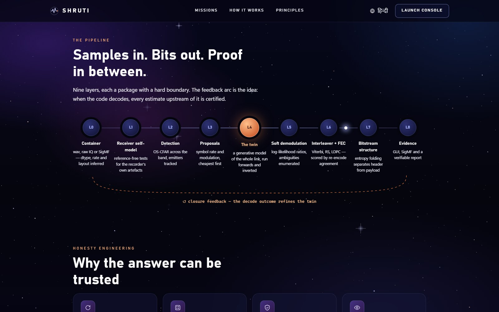 | 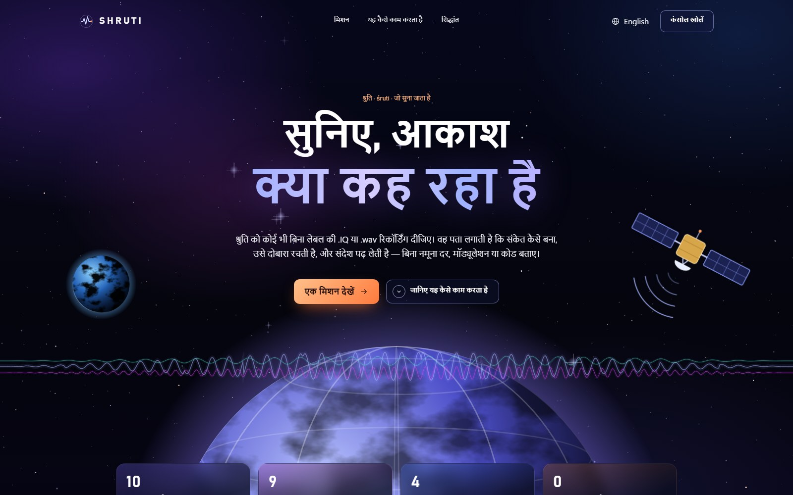 |

<p align="center">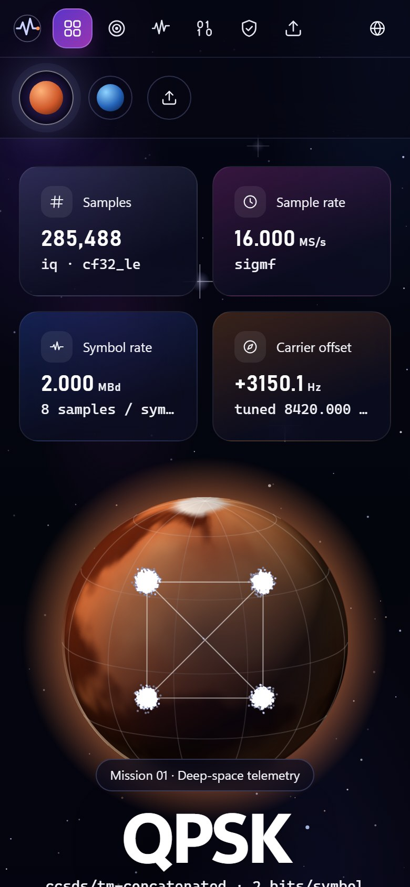</p>

---

## How it works

```
L0  container + format inference     wav / raw IQ / SigMF, dtype sniffing, rate basis
L1  receiver self-model              reference-free artefact tests
L2  wideband detection               OS-CFAR, emitter tracking
L3  proposal short-list              classical estimators first
L4  the twin                         forward synthesis + inversion  ← the project
L4b iterative peeling                subtract the strongest, re-scan
L5  soft demodulation                LLRs, not hard bits; ambiguities enumerated
L6  interleaver + FEC                library match, algebraic, soft-syndrome
L7  bitstream structure              framing, entropy, field typing
L8  interface, SigMF, evidence
         ▲                                    │
         └────── closure feedback ────────────┘
```

**The feedback arrow is the idea.** Three things follow from having a
*generative* model rather than a classifier:

1. **Proof from the code itself.** Decoded bits are re-encoded and checked
   against what was received. Re-rendering the whole waveform and comparing it
   with the original samples is the next step.
2. **A test oracle that never runs dry.** The chain that analyses signals can
   also make them, so labelled test files, both `.IQ` and `.wav`, are unlimited.
3. **Honest refusal.** An answer without code proof is reported as PROBABLE,
   never IDENTIFIED, and capabilities grey themselves out when a capture is too
   short. A χ² goodness-of-fit test on the rebuilt waveform is planned.

**What runs today.** The analysis uses L0, L3, L5, L6 and L7, and can write an
L8 evidence bundle. L1, L2 and L4b are built and tested as separate modules but
are not yet wired into the analysis. The twin's forward synthesis works (it
makes every test file); inverting it and closing the feedback loop are planned.

The layer-by-layer design is in [`docs/ARCHITECTURE.md`](docs/ARCHITECTURE.md).

---

## Waveform cartridges — a waveform is *data*, not code

```yaml
# cartridges/milstd/188-110a-serial-2400.yaml
id: mil-std-188-110a/serial-2400
band: HF
chain:
  - fec:            {type: convolutional, K: 7, rate: "1/2", poly: ["0o133", "0o171"]}
  - interleaver:    {type: block, rows: 40, cols: 72}
  - scrambler_post: {type: additive, poly: "0o1001", seed: "0xBAD", width: 9}
  - mapper:         {type: psk, order: 8}
  - shaping:        {type: rrc, rolloff: 0.35}
  - modulator:      {symbol_rate_bd: 2400, centre_hz: 1800, ssb: usb}
```

One file, and every layer picks it up at once: the twin gets a forward model,
the FEC layer gets something to match against, and the report gets to say
*"consistent with MIL-STD-188-110A"* instead of *"8-PSK"*. **Adding a waveform
is writing a text file, not changing code**, as long as it is built from blocks
SHRUTI already supports: PSK, QAM or FSK; convolutional, Reed–Solomon or LDPC
codes; block, convolutional, diagonal or pseudo-random interleavers. The library in
[`cartridges/`](cartridges) covers CCSDS telemetry, MIL-STD-188-110A and a set
of generic PSK, QAM and FSK waveforms.

---

## What is in this repository

This repository carries the complete interface, the architecture, the waveform
library and the foundation layers of the engine. The decoding core is held back
while the project is in development and will be published with the final
release.

| Part | Where | Here |
|---|---|---|
| Web interface — landing, console, bilingual, recorded missions | [`frontend/`](frontend) | ✅ |
| Architecture and deployment documents | [`docs/`](docs) | ✅ |
| Waveform library — 10 cartridges | [`cartridges/`](cartridges) | ✅ |
| Core maths — GF(2) linear algebra, statistics, bit utilities | `shruti/core` | ✅ |
| Cartridge schema and loader | `shruti/cartridge` | ✅ |
| L0 container and format inference — wav, raw IQ, SigMF | `shruti/l0_container` | ✅ |
| L3 classical estimators | `shruti/l3_proposals` | ✅ |
| L4 modulation mappers and pulse shaping | `shruti/l4_twin` | ✅ |
| L6 convolutional code with Viterbi decoding, Reed–Solomon, LDPC, GF(256), the four interleaver families, scramblers | `shruti/l6_fec` | ✅ |
| L7 bit-stream correlation | `shruti/l7_bits` | ✅ |
| Web API and plot extraction | `shruti/web` | ✅ |
| Every layer's public interface (`__init__.py`) | `shruti/l*/` | ✅ |
| The twin's forward chain and channel models, soft demodulation, FEC library matching, frame recovery, evidence bundles, the analysis pipeline, the test suite | — | 🔒 final release |

Until the core is published, the Python package here does not analyse captures
on its own; the interface runs standalone on the recorded missions.

---

## Design commitments

- **Nothing is asked of the analyst.** No sample-rate dialogue, no dtype
  picker. Container inference says what it concluded and why, on every panel.
- **Never needs a network.** No licence server, no model download, no
  telemetry, no CDN. The interface bundles every asset, and
  [CI](.github/workflows/ci.yml) fails the build if the bundle references an
  external origin.
- **Permissive dependencies only.** Every runtime dependency is BSD-3, MIT or
  Apache-2.0 — zero GPL, zero LGPL — enforced by a CI licence audit. SigMF is
  implemented against the spec; GF(2), GF(256), Viterbi, RS and LDPC are
  SHRUTI's own.
- **Bilingual.** English and हिन्दी throughout.

---

## Deployment

| Tier | Target | Status |
|---|---|---|
| T0 | Static interface → Firebase Hosting / GitHub Pages | **live** — [shruti-55e53.web.app](https://shruti-55e53.web.app) |
| T1 · T2 | Engine in a container → Hugging Face Spaces / Google Cloud Run | with the final release |
| T4 | Offline installer for an air-gapped laptop — the real product | with the final release |

Details in [`docs/DEPLOY.md`](docs/DEPLOY.md).

---

## Known limits

Stated up front rather than left to be discovered:

- **Only waveforms in the library are decoded.** Anything else gets UNKNOWN or
  PROBABLE. In a 20-file test with the true waveform removed from the library,
  SHRUTI never claimed IDENTIFIED. Blind recovery of unknown codes is planned.
- **Uncoded waveforms can't be proven.** With no check bits there is nothing to
  verify, so even a correct match is reported as PROBABLE, never IDENTIFIED.
- **An unknown pseudo-random interleaver permutation is not blindly
  recoverable.** SHRUTI de-interleaves it when the permutation is in the
  cartridge; detecting an unknown one and bounding its period and depth is
  planned.
- **Absolute sampling frequency is not identifiable from a headerless file.**
  Every measurable quantity is a ratio. SHRUTI takes the rate from the `.wav`
  header, SigMF metadata or a recorder's filename convention and reports which;
  for a bare raw file it says *not identifiable*. Solving it from in-band
  anchors is planned.
- **Mono SSB audio and ionospheric fading are being hardened.** The twin renders
  both, but in our blind tests only 2 of 6 SSB audio files and 3 of 20 fading
  files were proven right — which is why the HF mission is an I/Q recording on a
  clean channel.
- **RS uses the conventional basis**, not CCSDS's dual-basis symbol
  representation; each cartridge declares `basis: conventional`.
- Puncturing patterns are implemented but not yet verified bit-for-bit against
  the CCSDS Blue Book.

---

## Documents

- [`docs/ARCHITECTURE.md`](docs/ARCHITECTURE.md) — layer-by-layer design
- [`docs/DEPLOY.md`](docs/DEPLOY.md) — every deployment tier
- [`docs/ui/`](docs/ui) — interface screenshots, and how to regenerate them
